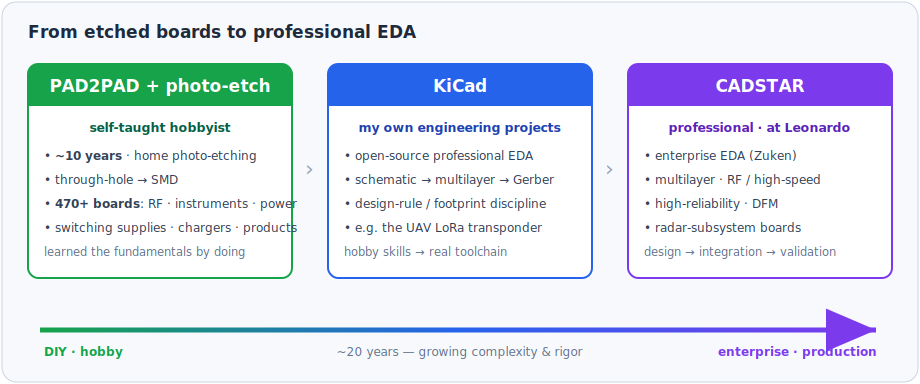
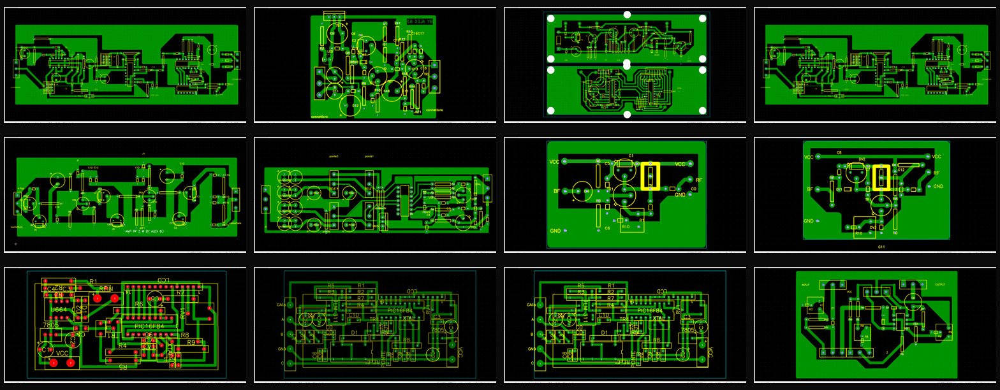
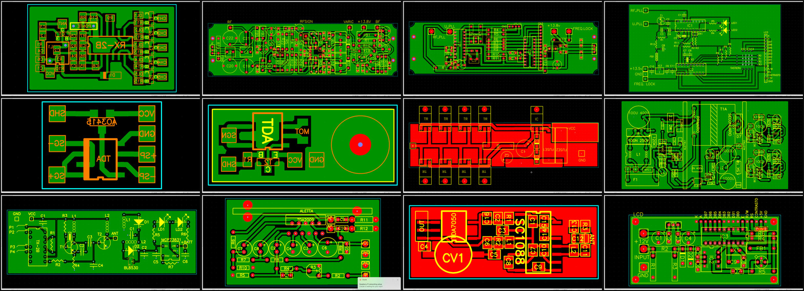
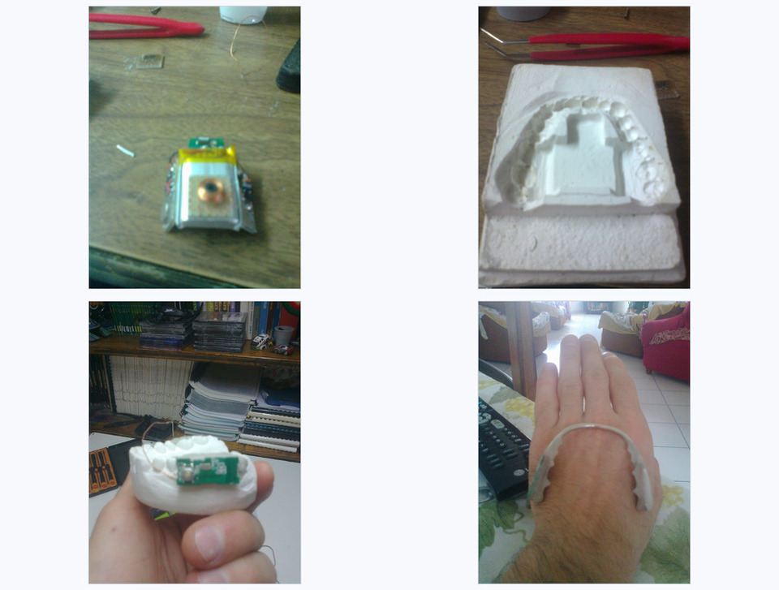

# 🛠️ PCB Design Journey — from etched boards to professional EDA

A ~20-year progression as a PCB designer, in three stages: a **self-taught hobbyist** (home photo-etching + PAD2PAD) → **KiCad** for my own engineering projects → professional **CADSTAR** at Leonardo. This repo shows the early hobby work and the path that followed.

   
  <em>Three stages, growing complexity and rigor — from DIY etching to enterprise EDA.</em>

## Stage 1 — Self-taught roots: photo-etching + PAD2PAD

I started building PCBs as a **teenager (around 15)** and never stopped. For about **ten years** PAD2PAD was my main design tool — boards I etched at home by **photo-etching** and toner-transfer. They began as simple single-sided **through-hole** circuits and grew, over that decade, into dense **SMD** and far more professional, product-grade designs — **470+ boards** in all: RF (FM transmitters, VFO+PLL synthesizers, receivers, radio-control), oscillators (Colpitts, Hartley), test instruments (frequency / LC meters, power supplies, transistor testers), switching/boost power supplies, multi-MOSFET power stages, chargers, and complete **multi-board products**.

This is where the fundamentals were learned *by doing* — routing, ground management, footprints, **SMD**, and designing for the constraints of home fabrication.

   
  <em>A dozen of the 470+ PAD2PAD boards — the body of work spans from through-hole RF and instruments to SMD and complete multi-board products. Individual layouts in <a href="docs/images/boards">docs/images/boards</a>.</em>

As the years went on the boards got denser and more *product-like* — RF receivers and radio-control links, audio amplifiers (TDA family), switching/boost converters, power stages with several MOSFETs, LCD-based instruments, and even a small multi-board **RF VFO + PLL synthesizer** — all still designed in PAD2PAD and etched at home.

   
  <em>A more advanced set: RF receivers &amp; radio-control · an RF VFO + PLL synthesizer (multi-board) · TDA audio amplifiers · a multi-MOSFET power stage · boost converters · LCD instruments. More layouts in <a href="docs/images/boards">docs/images/boards</a>.</em>

### A product-grade highlight — a bone-conduction dental hearing aid (2014)

The SMD / multi-board end of this PAD2PAD decade produced a complete **assistive-tech prototype**: a **bone-conduction hearing device** worn like a dental retainer.

Audio streamed over **Bluetooth** from a phone; a small stack of my own SMD boards — **driver/amplifier, battery, charge and connector** — drove a transducer (a piezo capsule / micro-vibration motor) at audio frequency. The electronics and transducer were embedded in a **dental acrylic retainer**, molded on an impression I took myself (alginate → stone cast), so the vibration couples straight into the **teeth and jaw bone** and on to the cochlea.

The idea: a **non-invasive** aid for **conductive hearing loss** — a damaged outer/middle ear but a working cochlea — the same bone-conduction principle used by bone-anchored hearing aids, here through the teeth instead of a surgical implant.

It's a personal prototype, but it's the honest culmination of the hobby stage: **several SMD boards, a real mechanical/acoustic integration, and an actual wearable product** — not just a single etched board.

   
  <em>Top-left → bottom-right: my SMD driver/transducer board · a dental impression I cast myself · the electronics integrated onto the mold · the finished wearable bone-conduction retainer.</em>

## Stage 2 — KiCad: my own engineering projects

I moved to **KiCad** (open-source professional EDA) for my own embedded projects — schematic capture, multilayer layout and Gerber output, with proper design-rule and footprint discipline.

A worked example is the **[UAV LoRa transponder](https://github.com/corgiolu-labs/uav-lora-transponder)** — an 868 MHz LoRa safety transponder for civil drones (ESP32 / Arduino Nano + EByte E220 + GPS), whose boards were designed in KiCad (schematics and wiring are in that repo).

## Stage 3 — CADSTAR: professional, at Leonardo

At **Leonardo** I design PCBs professionally in **Zuken CADSTAR** — enterprise EDA for **multilayer, RF / high-speed, high-reliability** boards: formal design rules, design-for-manufacturability, and the full cycle from schematic to **integration and validation** of radar subsystems.

> *This stage is shown by skills, not artifacts — those designs are the company's and are not reproduced here. The journey is the point: the same instincts learned etching boards at home now apply on enterprise tooling.*

## Skills across the journey

Schematic capture · multilayer PCB layout · RF / analog · ground planes & impedance · DFM · photo-etching & home fabrication · Gerbers · **EDA tools: PAD2PAD · KiCad · CADSTAR** · from prototype to production.

## Author

**Alessandro Corgiolu** — System / Embedded Integration & Validation Engineer
GitHub [@corgiolu-labs](https://github.com/corgiolu-labs) · part of a hardware portfolio that includes [JONNY5](https://github.com/corgiolu-labs/jonny5), the [UAV LoRa transponder](https://github.com/corgiolu-labs/uav-lora-transponder), the [DED powder-flow sensor](https://github.com/corgiolu-labs/ded-powder-flow-sensor), the [ESP32 radar](https://github.com/corgiolu-labs/esp32-radar-tracking) and [RASPYNVERTER](https://github.com/corgiolu-labs/raspinverter).
